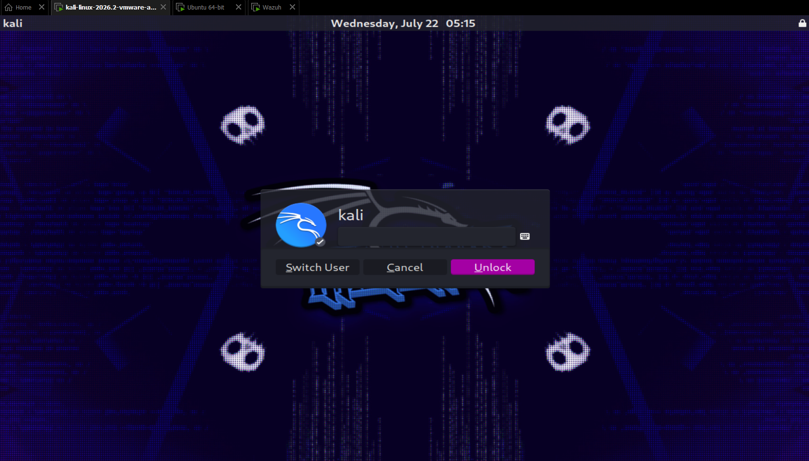
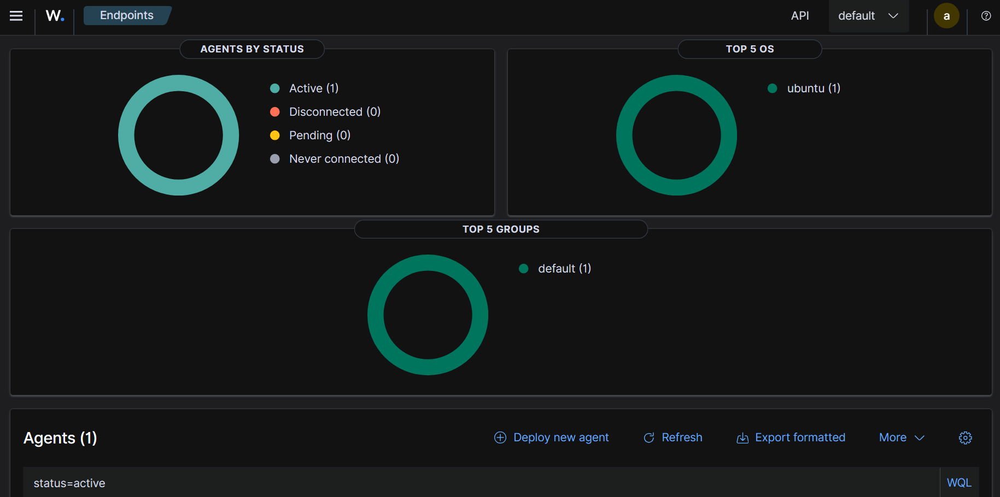
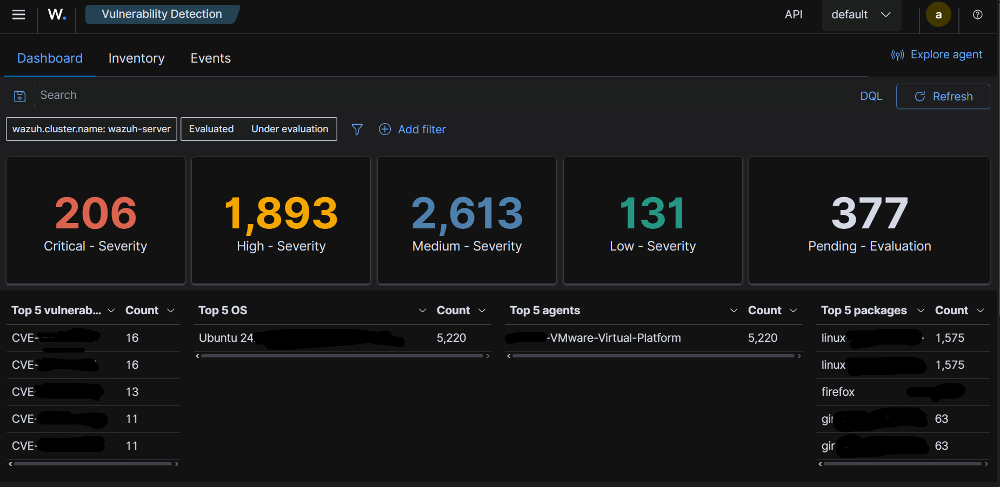
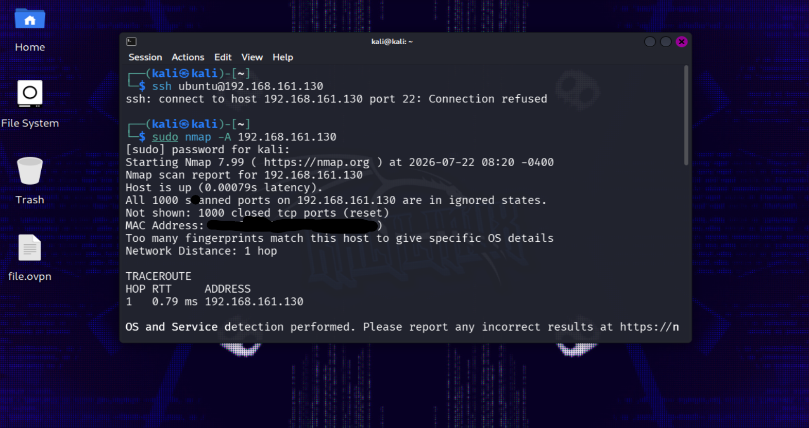
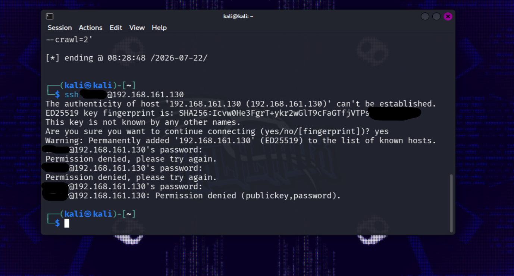
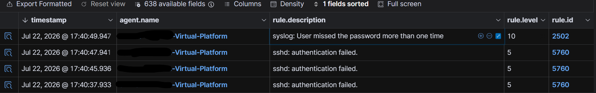
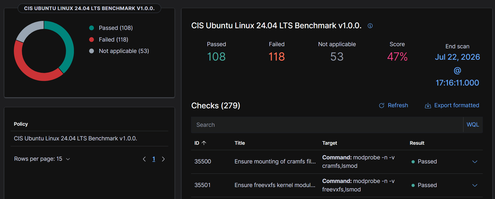

# Wazuh SIEM Lab

**Difficulty:** Intermediate  
**Tools:** Wazuh, Ubuntu 24.04, Kali Linux

## Overview

In this lab, I built a small SOC environment using Wazuh to monitor an Ubuntu endpoint from a centralized SIEM server. The objective was to understand how Wazuh collects logs, detects security events, and helps analysts investigate suspicious activity in real time.

---

## Lab Setup

- **Wazuh Server:** `192.168.161.138`
- **Ubuntu Agent (Monitored):** `192.168.161.130`
- **Kali Linux (Attacker):** `192.168.161.139`

### Virtual Machines Running



---

## What I Did

### 1. Connected the Ubuntu Agent

Installed the Wazuh agent on Ubuntu, configured it to communicate with the Wazuh server, and verified that it was actively sending logs.



---

### 2. Explored the Wazuh Dashboard

Verified that the agent was visible in the dashboard and explored the Vulnerability Detection and monitoring features.



---

### 3. Tested Detection with Nmap

Performed an Nmap scan from the Kali machine against the Ubuntu endpoint to see whether Wazuh would detect the activity.

```bash
nmap -A 192.168.161.130
```

Although the scan reached the target successfully, it did **not** generate alerts in the default Wazuh configuration. This helped me understand that not every attack or scan is detected automatically and that detection depends on configured rules and log sources.



---

### 4. Generated Authentication Events

To verify that Wazuh was correctly monitoring security events, I performed several SSH login attempts using incorrect credentials from Kali.

```bash
ssh ammar@192.168.161.130
```

These failed login attempts generated authentication logs on the Ubuntu system.



---

### 5. Investigated Alerts

Using the Threat Hunting dashboard, I confirmed that Wazuh successfully detected the failed SSH authentication attempts along with related security events.

Examples of alerts included:
- SSH authentication failed
- Multiple failed password attempts
- PAM login sessions
- Successful `sudo` activity



---

### 6. Reviewed Compliance

Finally, I reviewed the Security Configuration Assessment (SCA) results based on CIS Ubuntu 24.04 benchmarks.

The compliance score indicated that the system still had several hardening recommendations, demonstrating how Wazuh can also be used for security compliance monitoring.



---

## Key Takeaways

- Successfully deployed and configured a Wazuh SIEM environment.
- Connected and monitored an Ubuntu endpoint using the Wazuh agent.
- Learned how endpoint logs are collected and analyzed.
- Generated and investigated authentication-related alerts.
- Understood why some activities (such as a basic Nmap scan) may not trigger alerts by default.
- Explored Security Configuration Assessment (SCA) using CIS benchmarks.

---

## Skills Demonstrated

- SIEM Deployment
- Wazuh Agent Configuration
- Threat Hunting
- Log Analysis
- Authentication Monitoring
- Security Configuration Assessment (SCA)
- Basic SOC Investigation
- Linux Administration

---

## Conclusion

This lab provided hands-on experience with a SIEM platform and demonstrated how SOC analysts monitor endpoints, investigate authentication events, and validate that security monitoring is functioning correctly. It also reinforced the importance of understanding detection rules instead of assuming every attack or scan will automatically generate alerts.
